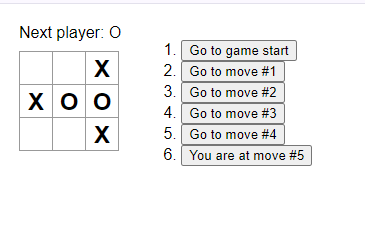

# React Tic-Tac-Toe Tutorial

This was made by following along with the [tutorial](https://react.dev/learn/tutorial-tic-tac-toe) on the official React Documentation.

This game of tic-tac-toe includes a feature to return to previous turns of the game, this was made possible with React's `useState` hook.

Preview:

    

